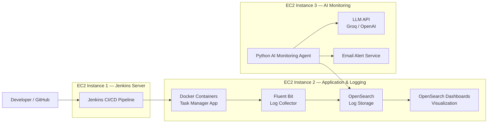

Below is a **complete, professional, copy-paste ready README** with an **architecture diagram included**.
You can paste this directly into your `README.md` in the repo.
It is written in a **production-style, DevOps/Cloud portfolio standard**, aligned with your real project.

---

# Task Manager AI Log Monitoring & Observability Platform


---

# Table of Contents

* Project Overview
* Problem Statement
* Architecture Diagram
* Features
* Technologies Used
* Repository Structure
* How the System Works
* AI Agent Workflow
* LLM Integration
* AWS Deployment (Free Tier Friendly)
* Setup and Installation
* Running the Project
* Testing the System
* Security Best Practices
* Future Improvements
* Resume Summary

---

# Project Overview

This project is an **end-to-end AI-driven log monitoring and observability platform** designed for modern DevOps and cloud-native environments.

The system centralizes logs from:

* Docker containers
* Application services
* Jenkins CI/CD pipelines

It then uses a **Python-based AI monitoring agent** to:

* Continuously fetch recent logs
* Detect failures automatically
* Perform root-cause analysis
* Rank possible causes
* Send real-time alerts with suggested fixes

The goal is to reduce manual troubleshooting time, improve system reliability, and automate incident response.

---

# Problem Statement

In production environments, logs are distributed across multiple systems:

* Application logs
* Container logs
* CI/CD pipeline logs
* Infrastructure logs

When failures occur, engineers typically need to manually:

* Search logs
* Identify errors
* Diagnose root causes
* Notify stakeholders

This process is slow, repetitive, and error-prone.

This project solves that problem by building a **centralized AI-assisted monitoring platform** that automatically detects incidents and recommends fixes.

---

# Architecture Diagram

Copy-paste ready for GitHub.



---

# High-Level Architecture

The platform runs across **three AWS EC2 instances**.

## Jenkins EC2

Responsible for:

* Running CI/CD pipeline
* Building application
* Deploying Docker containers
* Generating pipeline logs

---

## Task Deploy EC2

Responsible for:

* Running Docker containers
* Running Fluent Bit
* Running OpenSearch
* Storing logs

---

## AI Agent EC2

Responsible for:

* Fetching logs from OpenSearch
* Detecting failures
* Performing root-cause analysis
* Calling LLM API
* Sending alerts

---

# Features

Centralized log monitoring
Automated incident detection
Real-time alerting
Root-cause analysis
Smart root-cause ranking
AI-assisted failure investigation
Incident grouping
Alert cooldown logic
Historical incident storage
Multi-EC2 distributed architecture
CI/CD pipeline monitoring
Low-cost deployment support
Secure credential handling
LLM integration support

---

# Technologies Used

## Cloud

AWS EC2
Linux

## CI/CD

Jenkins
GitHub

## Containers

Docker
Docker Compose

## Logging

Fluent Bit
OpenSearch
OpenSearch Dashboards

## Application

Node.js
Express.js
React
MongoDB

## AI / Monitoring

Python
Requests
SMTP
LLM API (Groq / OpenAI)

---

# Repository Structure

```text
task-manager-observability-platform/

task-manager-app/
backend/
frontend/
docker-compose.yml

ai-agent/
app.py
analyzers/
clients/
services/
config/
utils/
requirements.txt

jenkins/
Jenkinsfile

opensearch/
docker-compose.yml

fluent-bit/
fluent-bit.conf
parsers.conf

docs/

README.md
.gitignore
```

---

# How the System Works

Step 1 — Developer pushes code to GitHub

Step 2 — Jenkins pipeline builds application

Step 3 — Docker containers are deployed

Step 4 — Logs are generated

Step 5 — Fluent Bit collects logs

Step 6 — Logs are stored in OpenSearch

Step 7 — AI agent fetches recent logs

Step 8 — Incident is detected

Step 9 — Root cause is analyzed

Step 10 — Alert is sent

---

# AI Agent Workflow

The monitoring agent runs continuously.

Each cycle performs:

1. Check OpenSearch health
2. Fetch recent logs
3. Detect incidents
4. Group incidents
5. Extract evidence
6. Perform heuristic analysis
7. Call LLM if needed
8. Rank possible causes
9. Send alert
10. Store incident

---

# Example Root Cause Ranking

```json
{
  "top_possible_causes": [
    {
      "cause": "MongoDB password invalid",
      "score": 0.91
    },
    {
      "cause": "User lacks permissions",
      "score": 0.73
    },
    {
      "cause": "Network connectivity issue",
      "score": 0.28
    }
  ]
}
```

---

# LLM Integration

The AI agent integrates with external LLM APIs to enhance failure analysis.

Supported providers:

Groq
OpenAI
Local LLM

The LLM is used only when:

* heuristics cannot determine root cause
* failure is complex
* additional reasoning is required

This design ensures:

Fast detection
Low cost
High reliability

---

# AWS Deployment (Free Tier Friendly)

This project is designed to run on low-cost infrastructure.

Typical setup:

Jenkins EC2
Deploy EC2
AI Agent EC2

Recommended instance type:

t2.micro
t3.micro
t4g.micro

Recommended configuration:

1 vCPU
1 GB RAM
Linux

This setup is suitable for:

Learning
Portfolio projects
Interview demonstrations
Proof of concept environments

---

# Setup and Installation

## Prerequisites

Install:

Git
Docker
Docker Compose
Python
Node.js
Jenkins

---

# Clone Repository

```bash
git clone https://github.com/your-username/task-manager-observability-platform.git

cd task-manager-observability-platform
```

---

# Task Manager Setup

## Backend

```bash
cd task-manager-app/backend

npm install
```

Create `.env`

```env
PORT=5000
MONGO_URI=your_mongo_uri
JWT_SECRET=your_secret
```

Run backend:

```bash
npm run dev
```

---

## Frontend

```bash
cd ../frontend

npm install

npm start
```

---

# OpenSearch Setup

```bash
cd opensearch

docker compose up -d
```

Verify:

```bash
curl -k -u admin:password https://localhost:9200
```

---

# Fluent Bit Setup

```bash
cd fluent-bit

docker compose up -d
```

---

# AI Agent Setup

```bash
cd ai-agent

python3 -m venv venv

source venv/bin/activate

pip install -r requirements.txt
```

Create `.env`

```env
OPENSEARCH_HOST=localhost
OPENSEARCH_PORT=9200
SMTP_USER=email
SMTP_PASSWORD=password
GROQ_API_KEY=api_key
```

---

# Running the AI Agent

```bash
python app.py
```

Expected output:

```text
AI monitoring agent started
OpenSearch ping status: True
```

---

# Default Monitoring Configuration

Polling interval:

60 seconds

Log lookback window:

5 minutes

Log fetch size:

100 logs

Alert cooldown:

1800 seconds

---

# Testing the System

Trigger failures to test monitoring.

Examples:

Wrong database password
Missing environment variable
Jenkins build failure
Docker container crash
Invalid SMTP credentials

Expected result:

Incident detected
Root cause analyzed
Alert sent

---

# Security Best Practices

Never commit:

.env files
passwords
API keys
tokens
private keys

Use:

Environment variables
Secrets manager
Credential store

---

# Future Improvements

Slack notifications
Auto remediation
Dashboard analytics
Incident trends
Kubernetes support
Role-based alerts
Predictive monitoring

---

# Resume Summary

Developed an end-to-end AI-driven log monitoring and observability pipeline using Docker, Jenkins, Fluent Bit, and OpenSearch to centralize application and CI/CD logs; integrated a Python-based AI agent to automate failure detection, root-cause analysis, and real-time alerting with suggested fixes.

---

If you want next, I can generate:

* Draw.io architecture diagram file
* System design explanation for interviews
* Kubernetes version of this architecture
* Production-ready enterprise architecture
